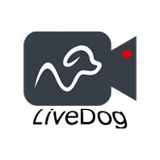
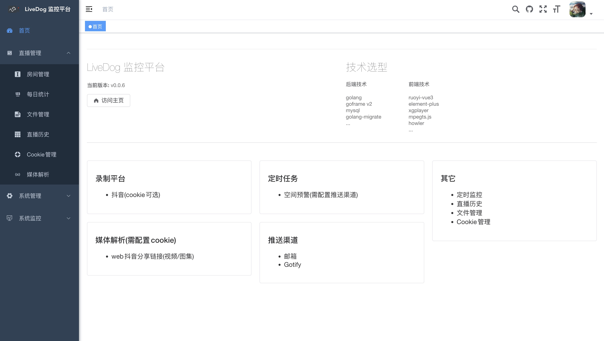

<p align="center">
  
  <h1 align="center">Live Dog</h1>
</p>

简体中文 ｜ [English](./README_EN.md)

## 简介

Live Dog 是一个基于 GoFrame 和 RuoYi-Vue3 构建的直播录制工具（暂只支持抖音平台）。

*本项目仅用于学习交流，不涉及任何（包括存储、上传、爬取等）私人信息。*



## 架构

- 后端采用 [Goframe 框架](https://github.com/gogf/gf)、MySQL
- 前端采用vue3、[RuoYi-Vue3](https://gitee.com/y_project/RuoYi-Vue)、[Element Plus](https://element-plus.org/zh-CN/)

## 内置功能

1. 直播管理
    - 直播列表
    - 直播历史
    - 文件管理
    - 每日统计
    - 媒体解析
2. 系统管理
    - 用户管理
    - 角色管理
    - 菜单管理
    - 字典管理
    - 推送渠道（邮件、Gotify）
3. 系统监控
    - 服务器监控
    - 定时任务（空间预警）

## 系统环境

- golang ：go1.20+
- 数据库：mysql5.7+
- Node ： 18+

## 快速开发

1. clone项目源代码

    `git clone https://github.com/shichen437/live-dog`

2. 安装 yarn

    ```
    npm install -g yarn 
    ```

3. 新建数据库（如：live-dog，推荐 utf8mb4 字符集）

4. 配置数据库连接信息
    ```
    copy manifest/config.yaml.example manifest/config.yaml
    ```

5. 启动服务端(内置数据库迁移)

    ```
    go run main.go
    ```

    如果在开发环境，热更新可使用

    ```
    make cli.install #首次运行
    gf run main.go
    ```

6. 打开web目录，启动前端

    ```
    yarn dev 
    ```

7. 登录初始账户

    账户：admin \
    密码：admin123

## Docker部署

1. 拉取镜像
    ```
    docker pull shichen437/live-dog:latest
    ```

2. 配置环境变量
    <table>
    <tr align="center">
      <th>变量名</th>
      <th>变量描述</th>
      <th>格式</th>
      <th>是否必填</th>
    </tr>
    <tr align="center">
      <td>DATABASE_DEFAULT_LINK</td>
      <td>数据库连接</td>
      <td>mysql:root:123456@tcp(192.168.3.16:13306)/live-dog?charset=utf8mb4&parseTime=true&loc=Local</td>
      <td>是</td>
    </tr>
    <tr align="center">
      <td>PROJECT_SM4KEY</td>
      <td>sm4加密 key</td>
      <td>abcdefghijklmnopqrstuvwxyz123456 (32位字符串)</td>
      <td>否</td>
    </tr>
    <tr align="center">
      <td>TZ</td>
      <td>时区</td>
      <td>Asia/Shanghai</td>
      <td>否</td>
    </tr>
    </table>

3. 运行

    ```
    docker run -d --name live-dog --restart=always \
    -p 9876:9876 \
    -e DATABASE_DEFAULT_LINK="mysql:root:123456@tcp(127.0.0.1:3306)/db?charset=utf8mb4 \
    -e PROJECT_SM4KEY="abcdefghijklmnopqrstuvwxyz123456" \
    -e TZ="Asia/Shanghai" \
    -v your_video_path:/LiveDog/video \
    -v your_upload_path:/LiveDog/upload \
    shichen437/live-dog:latest
    ```

## 支持平台

  <table>
    <tr align="center">
      <th>平台</th>
      <th>URL示例</th>
      <th>Cookie</th>
      <th>备注</th>
    </tr>
    <tr align="center">
      <td>抖音</td>
      <td>https://live.douyin.com/123456789</td>
      <td>✅</td>
      <td>推荐使用直播间 URL</td>
    </tr>
  </table>

## License

  Mit

## 感谢

- gf框架 <https://github.com/gogf/gf>
- golang-migrate <https://github.com/golang-migrate/migrate>
- RuoYi-Vue3 <https://gitee.com/y_project/RuoYi-Vue>
